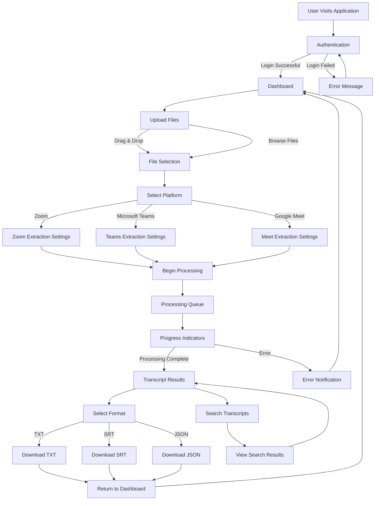

# Video Conference Transcript Extractor - User Flow

This document contains the user flow diagram for the Video Conference Transcript Extractor application.

## User Flow Diagram

## Flow Description

The user flow begins when a user visits the application and goes through the following stages:

1. **Authentication**: Users must log in to access the application
2. **Dashboard**: Main interface after successful authentication
3. **File Upload**: Users can upload video conference recordings via drag-and-drop or file browser
4. **Platform Selection**: Choose between Zoom, Microsoft Teams, or Google Meet
5. **Processing**: Files are processed with progress indicators
6. **Results**: View extracted transcripts with search and download capabilities
7. **Download Options**: Export transcripts in TXT, SRT, or JSON formats

## Supported Platforms

- **Zoom**: Video conference recordings from Zoom meetings
- **Microsoft Teams**: Recordings from Teams meetings
- **Google Meet**: Recordings from Google Meet sessions

## Export Formats

- **TXT**: Plain text format
- **SRT**: Subtitle format with timestamps
- **JSON**: Structured data format for programmatic use
